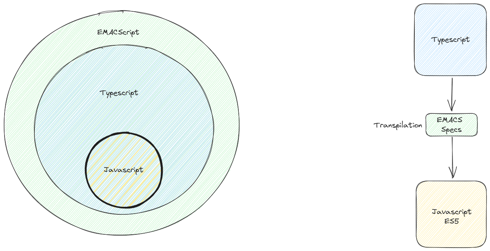

# Descripción general

En este curso sobre typescript vamos a aprender sobre el uso de las capacidades avanzadas del lenguaje para definir typos estaticos y como usarlos para comprobar datos en tiempo de desarrollo, compilacion y en algunos casos "al vuelo" (tiempo de ejecucion) tambien aprenderemos como usar typescript para auto-ducumentar el codigo y reducir la cantidad de test a escribir para comprobar una funcionalidad.

## Que es Typescript?

Typescript es un superset de JavaScript. Decimos que una tecnología es un superset de un lenguaje de programación, cuando puede ejecutar programas de la tecnología, Typescript en este caso, y del lenguaje del que es el superset, JavaScript en este mismo ejemplo. Además, esto permite que uno pueda integrar Typescript en proyectos existentes de JavaScript sin tener que reimplementar todo el código del proyecto en Typescript, de hecho, es común que existan proyectos que introduzcan tanto Typescript como JavaScript.

Por si fuera poco, uno de los beneficios adicionales de esta característica del lenguaje, es que pone a disposición el enorme ecosistema de librerías y frameworks que existen para JavaScript. Con Typescript podemos desarrollas aplicaciones con React, Vue, Angular, etc.

<center>



</center>

## JavaScript Bajo el Capo

TypeScript es un superset de JavaScript y también es un lenguaje transpilado, eso significa que antes de que el código pueda ser ejecutado por el intérprete de JavaScript este debe “traducirse” de un lenguaje a otro. Por otro lado, el código de JavaScript resultante de las tareas de tras pilado es código estricto que puede ceñirse a una versión de la especificación ECMAScript siendo la más común ES5 la cual produce un código que puede ser ejecutado por la mayoría de los navegadores modernos.

Aunque TypeScript sea un lenguaje con capacidades de tipado estático la verdad es que el código resultante en JavaScript sigue siendo de asignación dinámica por lo cual es importante asegurar controles de datos basados en typeof, instanceof y comprobaciones literales, previniendo así inyecciones de datos no comprobados en tiempo de ejecución.

## Porque usar TypeScript?

Como ya dijimos TypeScript tiene capacidades de tipado estatico, esto no solo se oye bien si no que ademas se "ve bien" cuando lo usamos con algun IDE o Editor de Codigo como lo es VSCode el cual tiene integrado un Resaltador de sintaxis (lo conocemos como Linter) el cual nos ayuda a evaluar a partir de las definiciones de tipos asignadas a una sentencia de codigo si esta es correcta o no, o si presenta inconpatibilidades que de otra manera tendriamos que esperar a ejecutar el codigo para ciquiera comenzar a darnos cuenta de los errores sintacticos agregados por el programador lo cual es algo comun sobre todo en proyectos grandes con mas de un colaborador. Otro de los beneficios del uso de TypeScript en proyectos para producción es la auto-documentación que aporta el definir interfaces de tipos como contratos a los objetos declarados dentro del código, pero que quiere decir esto? Veamos los siguientes ejemplo en JavaScript y TypeScript respectivamente:

```javascript
function sum(a, b) {
  return a + b;
}

sum("hello", "world"); // output: 'helloworld'
sum(2, 2); // output: 4
```

El ejemplo de código anterior sugiere que una función `sum` recibe dos parámetros y los suma sin restricción de parámetros ni definición de la salida esperada, por lo que esto puede llevar a comportamientos inesperados en nuestra aplicación. Observemos el mismo caso de uso pero implementado en TypeScript:

```typescript
function sum(a: number, b: number): number {
  return a + b;
}

sum("hello", "world"); // Sintax Error
sum(2, 2); // output: 4
```

El ejemplo de código anterior está definido de forma tal que, en tiempo de desarrollo y compilación, el lenguaje es capaz de "darse cuenta" del error sintáctico introducido al violar el contrato de la función donde se establecen dos parámetros de entrada de tipo numérico dando como resultado un número también; Este ejemplo es básico apropósito, pero es suficiente para demostrar la utilidad del lenguaje para documentarse a través de la definición estática de contratos, la inferencia de tipos y la declaración explicita de la intención del código.

## Iniciar un proyecto con Typescript

Para iniciar un proyecto con TypeScript solo tenemos que seguir las instrucciones de instalación desde su web oficial en [TypeScript: How to set up TypeScript](https://www.typescriptlang.org/download) haciendo la recomendación de siempre instalar TypeScript de manera local para cada proyecto.
